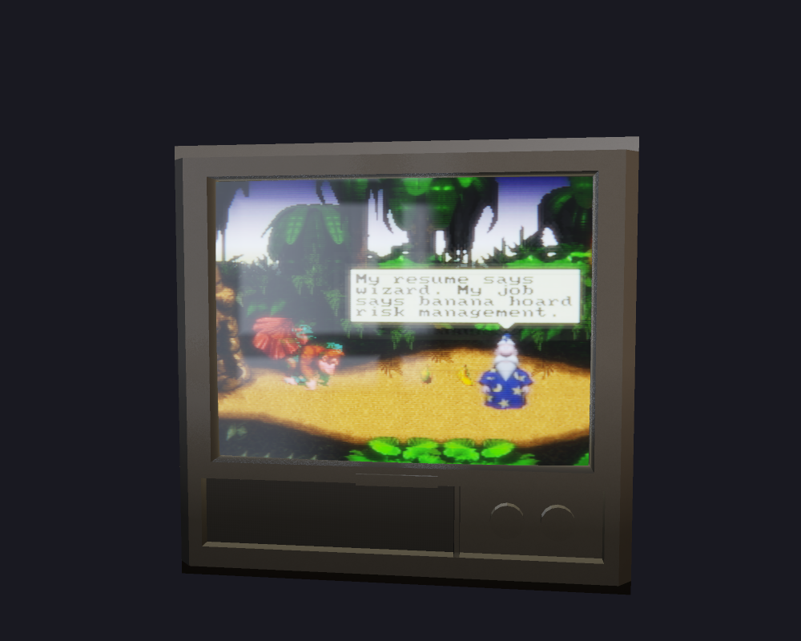
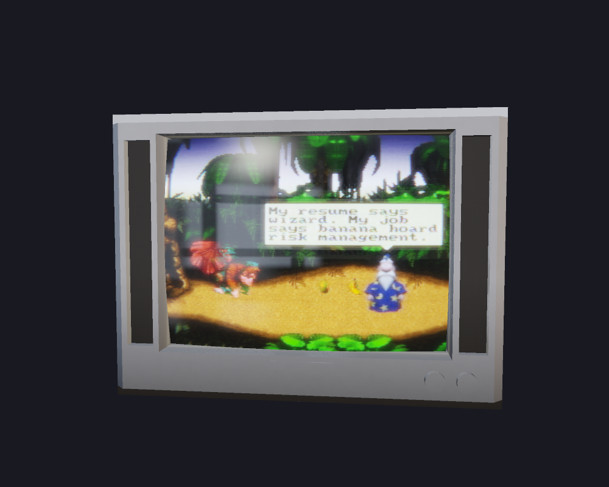
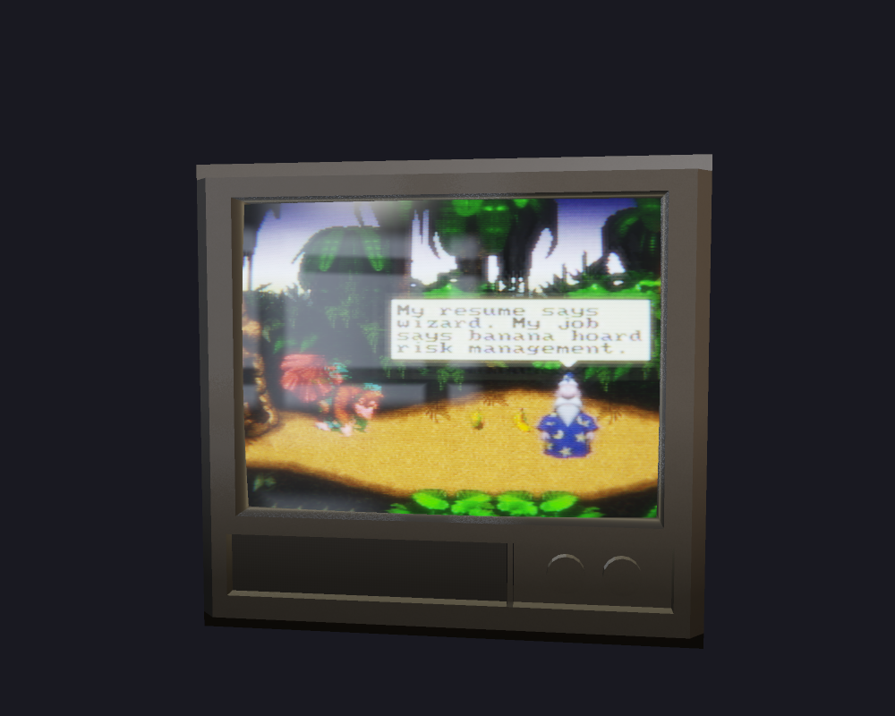
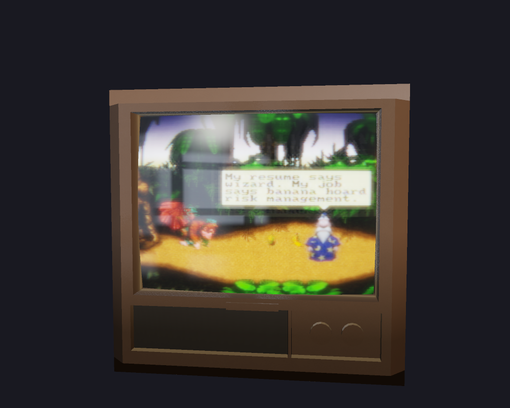
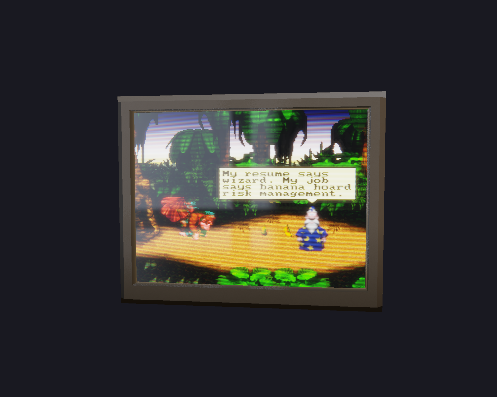
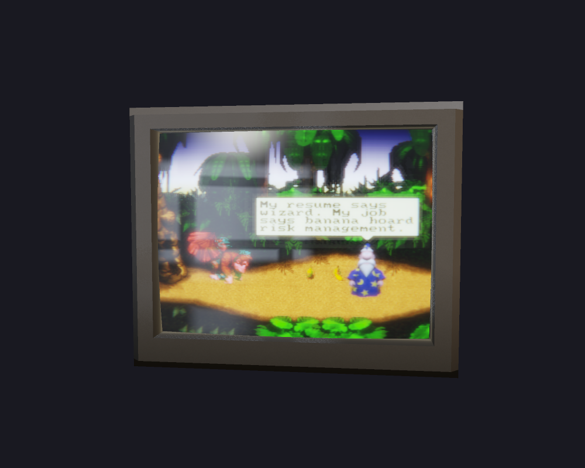
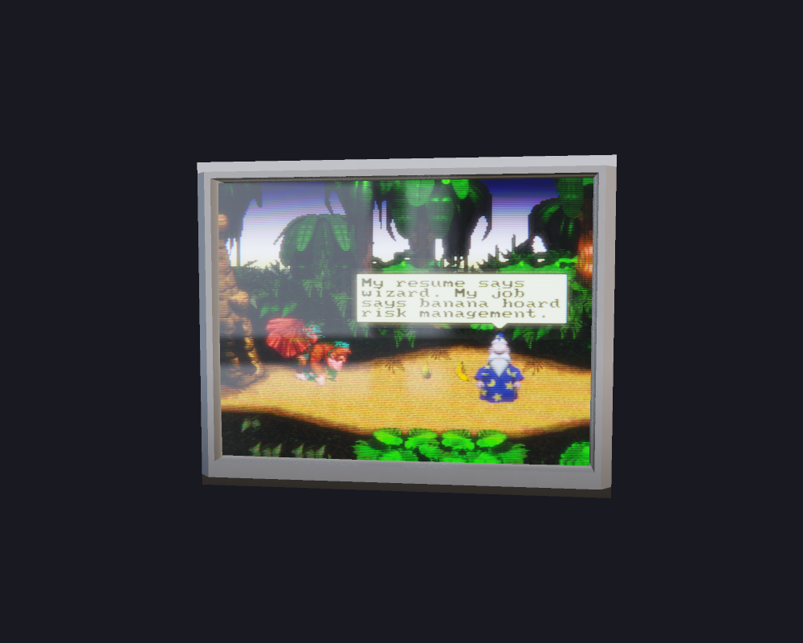
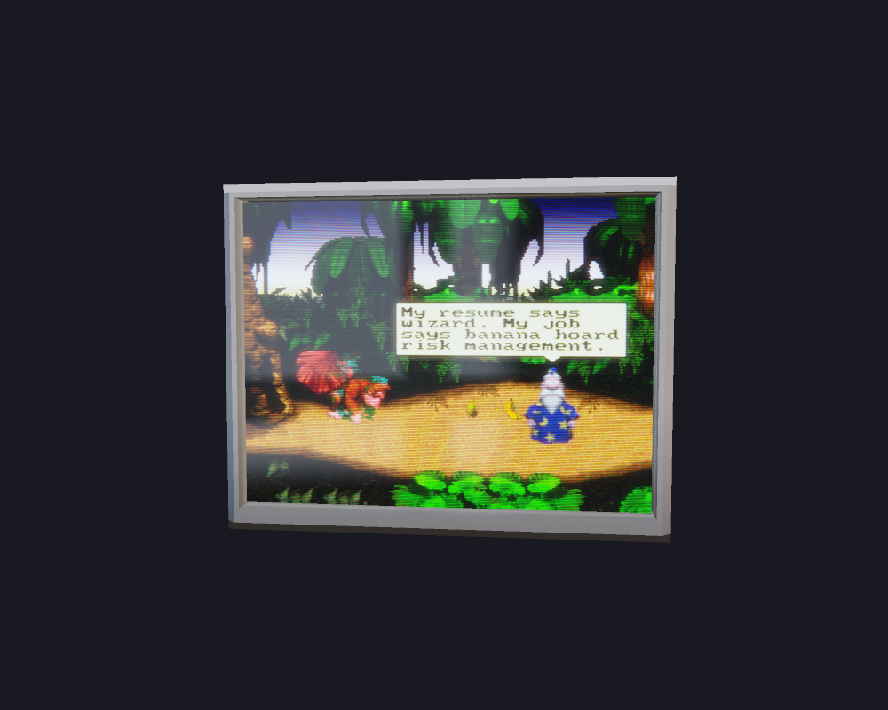
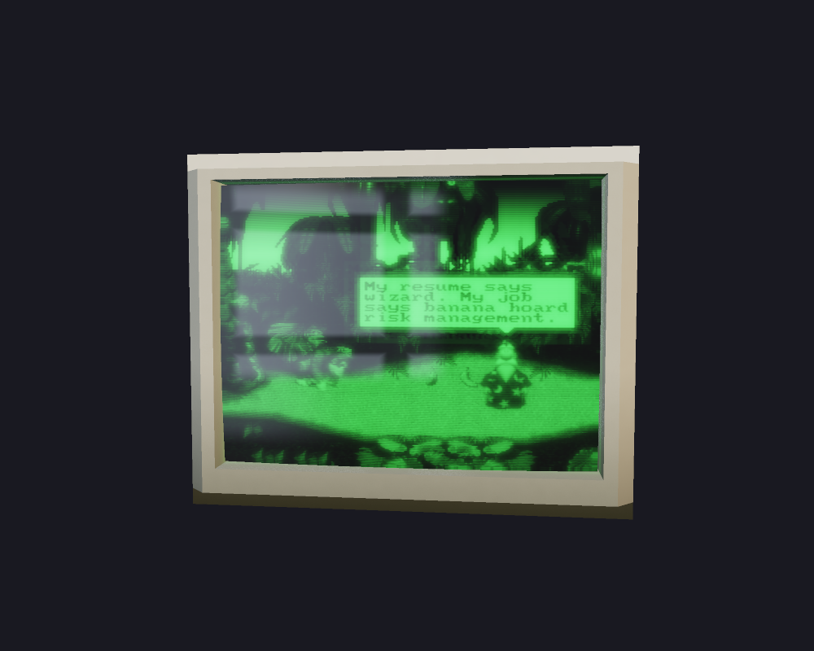
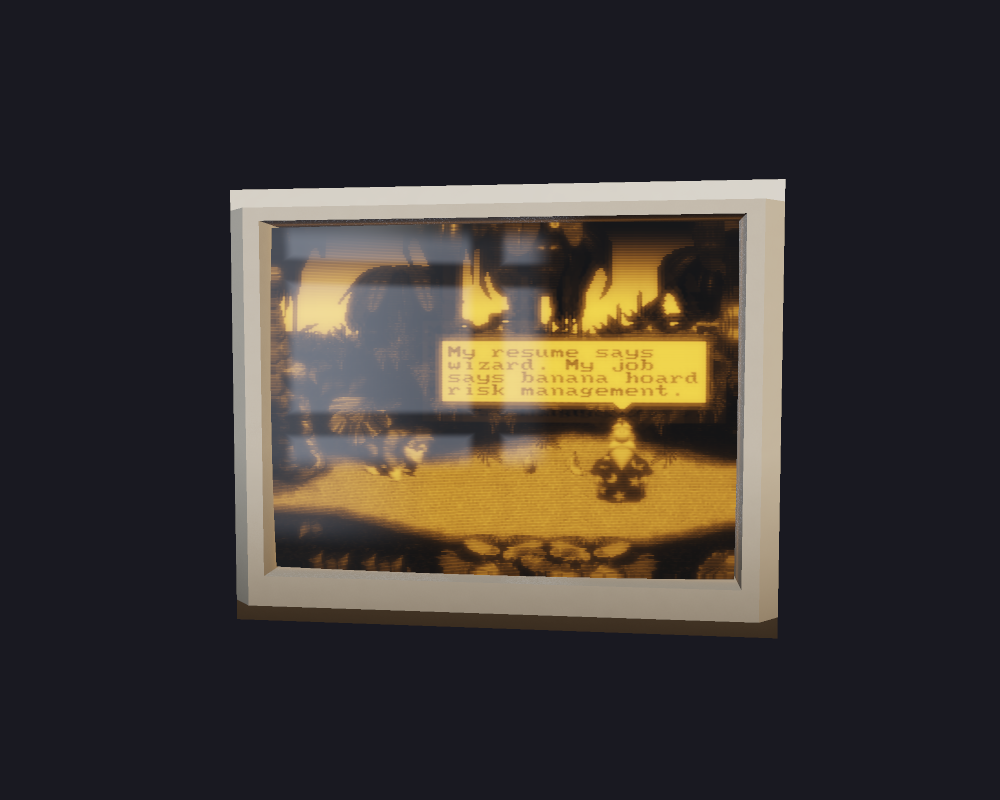

# crtulum

A CRT you can hold in your hands, minus the 70 pounds of leaded glass and the risk
of the flyback transformer killing you in your garage.

It's a Wayland app that grabs another program's output — RetroArch, a terminal, a
browser, a video player, whatever — the same way OBS does window capture, and paints
it onto a 3D Trinitron
you can spin around with the mouse. Not a fullscreen filter. An actual tube, sitting
in your compositor, that you can orbit and zoom until the glare slides across the
glass the right way.


## Build & run

Build on Linux with a current stable Rust toolchain, a C compiler, `pkg-config`,
Clang/libclang, and development packages for PipeWire, D-Bus, Wayland, ALSA,
and udev. The package list used by CI is in
[the build workflow](.github/workflows/rust.yml).

Live capture needs a running PipeWire service and a desktop portal backend that
implements ScreenCast. Additional tools depend on the feature:

| Feature | Runtime tools/assets |
| --- | --- |
| Video/PNG export and media checks | `ffmpeg`, `ffprobe` |
| URL sources | `yt-dlp` plus ffmpeg |
| Live or scripted games | installed libretro core, ROM, and any BIOS the core requires |
| Existing `.bsv` replays | `retroarch` plus the matching core and ROM |
| Fetching Agent characters | `curl` |
| Character speech | `espeak-ng`, or a command supplied through `CRTULUM_TTS` |
| Webcam reflections | ffmpeg with V4L2 support and camera-device access |

Then:

```sh
cargo run -- --capture
```

A physical GPU with a Vulkan driver is required, including for headless rendering
and GPU tests. The app automatically enumerates Vulkan devices, prefers a discrete
card, and otherwise uses an integrated GPU. It logs the selected card and driver;
software adapters are rejected. No GPU-enabling switch is needed. If detection
fails, check device permissions and stale `VK_DRIVER_FILES`/`VK_ICD_FILENAMES`
overrides that can hide installed drivers.

CI runs on GitHub-hosted `ubuntu-latest`. Its separate `ci-software-vulkan` test
build executes headless shader and export checks on Mesa lavapipe. Normal builds
still require physical hardware; CI software results do not certify hardware
performance or display behavior.

`--capture` pops the screencast picker. Point it at something. It lands on the tube.
Running without a source displays the built-in test pattern. To install the
`crtulum` command used in the examples below, run `cargo install --path .`.

No window? Take a picture instead — handy when your compositor won't do
wlr-screencopy and `grim` gives up:

```sh
cargo run -- --shot out.png 1000x800
```

## Playing on it

The other direction: put a game on the tube and pick up a controller.

```sh
cargo run --release -- --play game.sfc
cargo run --release -- --play game.cue --core swanstation --option swanstation_GPU_Renderer=Vulkan
```

A libretro core runs in-process, one emulated frame per tick of the clock — not per
monitor refresh, so a 59.727 Hz Game Boy and a 60.099 Hz SNES each run at their own
speed whatever your display is doing. A gamepad is picked up automatically if one is
plugged in; its left stick is passed through as analog input as well as supplying
directional buttons. Stick clicks supply L3/R3. Otherwise the keyboard stands in:

| | |
| --- | --- |
| arrows | d-pad |
| Z / X | B / A |
| A / S | Y / X |
| Q / W | L / R |
| Enter · RShift | Start · Select |
| F2 | pause the game (the television keeps running) |

Every CRT control still works while you play — orbit the tube with the mouse, swap
presets with the number keys, cut the power with **P**. The game's buttons take
priority, so they can't also change the television.

The live window also has presentation controls: **F11** toggles borderless fullscreen
(**Esc** leaves fullscreen before quitting), **L** toggles the tight glass glare, and
**R** toggles the daylight-window reflection. The latter two are independent, so the
tube can be viewed under neutral glass lighting without adding a visible room cue.
Headless shots expose the same switches as `CRTULUM_GLARE=0` and
`CRTULUM_WINDOW_REFLECTION=0`.

**F4** toggles a live webcam room. Capture is off at startup. Once frames arrive,
its image replaces the synthetic room, including the daylight window and ceiling
highlights, in the curved glass and cabinet reflections. Camera colors also light
the cabinet and the glass's diffuse wash. The title shows when the camera is live;
pressing F4 again closes the camera and restores the usual room. Capture failure
or a five-second stall also releases the camera and restores the room; see the
terminal for the error and press F4 to retry. L/R retain their synthetic-room
settings for when the camera is off.

This optional feature requires **ffmpeg with V4L2 support** and access to a Linux
camera device (default `/dev/video0`). For another device or lens:

```sh
CRTULUM_WEBCAM_DEVICE=/dev/video2 CRTULUM_WEBCAM_FOV=70 cargo run --release
```

Mount the camera at the display, facing the viewer. `CRTULUM_WEBCAM_FOV` is the
horizontal field of view in degrees (20–140, default 70) of the center-cropped
4:3 feed. Capture requests 640×480 at 30 fps; frames are center-cropped without stretching
if the driver negotiates another aspect ratio.
The room stays fixed as you orbit; the reflection uses the glass normal, mirror
orientation and Fresnel response. A single SDR camera cannot recover room depth,
HDR light intensity or a full panorama: unseen directions use the feed's mean
linear color, and cabinet roughness uses an approximate blur. Capture stays local
in memory, with no recording or upload. It does not change the game/screen source
or enable camera capture in headless exports.


Sound comes from the core, resampled to whatever your audio device wanted.
`CRTULUM_PLAY_STATS=1` prints the emulated rate and how much audio is buffered, which
is what to look at if it ever feels off.

## Exporting video

The other half of the app: hand it a source and it renders the whole thing through
the tube and out the far side as a video file. Same shader, same phosphor planes,
same presets — just offline, and pointed at ffmpeg instead of a window.

```sh
# any video file
cargo run --release -- --render clip.mp4 out.mp4

# a URL (anything yt-dlp handles)
cargo run --release -- --render 'https://youtu.be/…' out.mkv --preset rca

# a directory of stills
cargo run --release -- --render frames/ out.mp4 --fps 30

# a ROM, with the run itself scripted frame-by-frame (see below)
cargo run --release -- --render --rom smb.nes out.mp4 --script run.crts
```

For lossless PNG sequences, use `--render frames/ out/ --codec png --fps 30`.
`--clip frames/ out/ [WxH]` is another spelling for PNG output through that same
renderer, defaulting to 60000/1001 fps and 1000×800. Both commands share the field
clock, phosphor history, scripts, signal processing, and GPU supersampling.
Use `--fps` to set the output cadence.
PNG sequences include a synchronized `audio.wav` alongside the frames, mixing
source, emulator, and character audio into lossless floating-point PCM. `--no-audio`
disables it; short audio tracks are padded to the rendered duration.

Audio comes along from the source. The tube advances at 60000/1001 (about 59.94)
fields/sec independently of export or monitor refresh rate. Interlaced fields excite
alternate source rows. Video taller than 576 lines is reduced to 480 by default;
smaller sources retain their resolution. Still sequences preserve each image’s
native dimensions unless `--lines`/`--source-size` is supplied (`--lines 240` selects a low-resolution
console raster). Higher line counts are appropriate for PC and HD
CRTs, but make scanline structure harder to resolve. Set `interlace on` in a script
for alternating fields.

`--help` for the rest: `--size`, `--fps`, `--ssaa` (3 by default, `1` for a fast
preview), `--start`/`--duration`, `--codec x264|x265|vp9|ffv1|png`, `--crf`, `--no-audio`.
Export runs without a real-time pacing limit. Throughput depends on the source,
GPU, resolution, preset, and supersampling.

### Scripts

A source alone gives you a static camera. A **script** gives you choreography — a
flat timeline of camera moves, tube swaps, power cycles and degausses:

```
size     1280x960
lines    240
preset   trinitron
camera   yaw=0.55 pitch=0.22 dist=3.4

at 0:00  power on                              # raster blooms open, auto-degauss
at 0:03  camera to yaw=-0.35 dist=3.0 over 6   # slow drift across the face
at 0:12  preset pvm                            # swap tubes mid-shot
at 0:14  exposure to 1.25 over 2
at 0:30  spin 1 over 10 linear                 # one full orbit
at 0:52  power off                             # collapse to a line, then a dot
```

```sh
cargo run --release -- --render clip.mp4 out.mp4 --script examples/demo.crts
```

Times are seconds or clock (`0:03`, `1:02:30.5`). Moves take `over <seconds>` and
ease by default (`linear` if you'd rather). Actions: `preset`, `camera`, `spin`,
`exposure`, `power on|off`, `degauss`, `interlace`, `subpixel`, `bfi`, `wait`. Set
`source` in the script and it's self-contained — `--render out.mp4 --script run.crts`.
Command-line flags override the script's setup lines, so one script works across
different sources and sizes. Two positional paths override a script's media source;
`--out` explicitly names the output. Typos are errors with a line number, not silent no-ops.

Downloads and emulator recordings are staged in `.crtulum/` next to the output, and
reused on the next run — so iterating on a script doesn't re-download or re-record.

### Scripting a run

Point the script at a ROM instead of a video and the same timeline drives the *run*
as well as the camera. crtulum loads a libretro core in-process and calls it one
frame at a time with the exact buttons that frame is scripted to hold — so it's
frame-exact, headless, deterministic, and unconstrained by real-time pacing
(actual throughput depends on the core, GPU, resolution, and supersampling):

```
rom      smb.nes
core     nestopia          # optional; guessed from the extension
frames   3600              # how long to run (or `duration 60`)

preset   trinitron
camera   yaw=0.3 pitch=0.2 dist=3.2

at 0:00     power on
frame 150   press start              # momentary — 4 frames unless you say otherwise
frame 180   hold right               # …stays down…
frame 240   press a for 20 frames    # a precisely-placed jump, mid-hold
frame 300   release right
frame 330   tap b                    # exactly one frame
```

```sh
cargo run --release -- --render run.mp4 --script examples/tas.crts
```

`at <time>` is wall clock; `frame <n>` is exact — write the run in frames, write the
camera in seconds. Verbs: `press`, `hold`, `release`, `tap`, with `for <n> frames`
or `for <seconds>`. `stick x,y` sets the left analog stick in −1..1 (positive Y
is down); `center stick` releases it. Buttons are the libretro names (`a b x y l r l2 r2 l3 r3 start
select up down left right`), several per line: `press a right`. Audio comes from the
core and is muxed in at the end. `CRTULUM_DEBUG_INPUT=1` prints the run as it plays,
one line per change, which is how you find out why a jump missed.

`examples/inputtest.nes` (built by `examples/make_test_rom.py`, ~70 bytes of 6502)
paints the screen a colour per button held, so a rendered run is a direct readout of
its own input timeline — that's how the frame-exactness above is tested rather than
asserted.

Pre-authored runs still work the other way: `--movie run.bsv` hands the whole thing
to RetroArch (`-P … --eof-exit -r`), which owns the emulation and input and records
a clip we then pipe through the tube. Use that for existing `.bsv`/replay files;
use `rom` + a script when you want to write the run here. The RetroArch pass runs in
real time in a window; the in-process path doesn't.

Cores are found in RetroArch's core directory (`--core` takes a name or a path). One
caveat: a libretro core is a shared library running in our process, so a core that
misbehaves takes the process with it — the mesen build on this machine segfaults when
hosted outside RetroArch, so the NES default order is nestopia, fceumm, quicknes,
then mesen.

### Someone to explain it

A run is more watchable with a narrator, so a script can put a **Microsoft Agent**
character on the screen — Clippy, Merlin, Genie, Peedy — and drive him along the same
timeline as the run:

```
agent    merlin

at 0.2   agent at 0.78,0.66            # bottom-right, where Clippy always sat
at 0.5   agent show                    # plays the character's own entrance
at 1.5   agent say "This run saves four frames on the first jump."
at 6.0   agent point 0.30,0.62         # turns and gestures at part of the picture
at 9.0   agent move to 0.22,0.30 over 1.2
at 11.0  agent play Congratulate       # any animation the character has, by name
at 13.0  agent hide
```

He is composited into the **signal**, before the tube — so he's made of phosphor like
everything else on the screen. The mask breaks him into RGB stripes, the beam blooms
his highlights, and when he crosses the screen he trails red as the green and blue
decay out from under him. Compositing him over the finished render would have made
him a sticker on a photograph.

Between instructions he falls back to his rest pose, and after a few idle seconds he
starts one of his own idle animations, the way he did on the desktop. Coordinates are
normalised to the picture (`0,0` top-left, `1,1` bottom-right), so they survive a
change of signal resolution. `agent point` and `agent move` pick the character's own
directional `Gesture`/`Move` animations from where he is to where you sent him.

`say` draws a word balloon that fills in as he speaks, and if `espeak-ng` is installed
he actually says it — a formant synthesiser, like the SAPI 4 voice the real thing used,
rather than something that sounds thirty years too new. `CRTULUM_TTS` replaces the
command (`{out}` is the WAV path, the text arrives on stdin) if you'd rather use
`piper` or anything else. His voice and the character's own sound effects are mixed
onto the game's audio, not over it.

Characters aren't in this repository — they're Microsoft's artwork and this is a
reader for them. `--fetch-agent` pulls the sprite sheet and frame table
[clippy.js](https://github.com/clippyjs/clippy.js) extracted from the original `.acs`
files:

```sh
cargo run --release -- --fetch-agent Merlin
cargo run --release -- --render out.mp4 --script examples/agent.crts
```

They land in `~/.local/share/crtulum/agents/`; `--agent` also takes an original
Microsoft Agent v2 `.acs` file or a directory holding an `agent.js` and a `map.png`,
and `$CRTULUM_AGENTS` adds a search root. The animation model is the `.acs` one — an image plus overlays, a duration, and
weighted branches back into the animation — so `agent play <name>` reaches anything
the character can do. Branch choices come from a seeded generator advanced only by
the frame loop, so a scripted run animates identically every time you render it.

Native ACS characters retain their palette art, frame layers, embedded sound effects,
and mouth-shape overlays. The overlays follow the synthesised speech amplitude for
lip-sync. clippy.js exports use their pre-baked speaking animations.

### Which systems

Three rendering paths, and the core chooses: a software framebuffer, **OpenGL** via a
headless EGL context, or **Vulkan** via an instance and device crtulum stands up for
it — including the context-negotiation handshake, so the core builds the device with
the features its renderer needs. No window, no display server, still deterministic.

| | |
| --- | --- |
| **Verified here** | NES · SNES · Game Boy · Mega Drive · N64 · PlayStation on **both Vulkan and OpenGL** — each one boots a real game in `cargo test` (see below), plus frame-exact input against the homebrew ROMs in `examples/` |
| **Same class, should just work** | Game Boy Advance, Master System, Game Gear, PC Engine, 32X, Atari 2600, Lynx, Neo Geo Pocket, WonderSwan, ColecoVision |
| **Known not to work** | `mupen64plus_next` runs its emulator on its own thread and makes GL calls from there, where our context isn't current. Use `parallel_n64` instead |

The real-game tests need a library, which obviously isn't in the repo — point
`CRTULUM_ROMS` at yours (it looks for `nes/`, `snes/`, `gb/`, `megadrive/`, `n64/`,
`psx/` subdirectories) and `cargo test` boots one game per system, or skips if it
isn't there. They assert nothing about any particular game: only that the core loads,
the picture gains structure and moves, the rate and geometry are sane, and the core
tears down cleanly. A separate test runs the same ROM twice through a full unload and
reload and requires identical frames — the property scripted runs depend on.

A GPU core needs nothing special from you:

```sh
crtulum --render out.mp4 --rom game.cue --option swanstation_GPU_Renderer=Vulkan
```

Two things that made the difference, in case you hit them elsewhere: the frontend has
to provide the **log and performance interfaces** (cores call straight through those
pointers and crash if they're absent), and a Vulkan core negotiating its device looks
for a queue family that can *present* — with no surface that search fails and the core
records an out-of-range index it later trips over. `VK_EXT_headless_surface` gives it a
real surface with no window, and the whole class of problem goes away.

Core options are passed with `--option key=value` (repeatable), or `option key=value`
in a script — that's how you reach a core's renderer setting.
`CRTULUM_TRACE_ENV=1` lists every option key a core asks for, and `CRTULUM_CORE_LOG=1`
shows the core's own log, which is usually where the real answer is.

Ambiguous extensions are left to you: `.bin` and `.iso` belong to half a dozen
machines, so those need `--core`.

## Presets

Ten tubes, with hardware-specific stripe pitch, TVL, phosphor gamut, and white
point. `--preset <name>` (default `trinitron`), or keys **1–9,0** live,
**Tab** to cycle.

| Key | Name          | What it is                                           |
| --- | ------------- | ---------------------------------------------------- |
| 1   | `trinitron`   | the one everybody remembers — aperture grille, cylindrical |
| 2   | `panasonic`   | consumer shadow mask, spherical face                 |
| 3   | `slotmask`    | slot mask, the awkward middle child                  |
| 4   | `rca`         | warm, fuzzy console set your grandparents owned      |
| 5   | `pvm`         | the broadcast monitor you couldn't afford            |
| 6   | `arcade`      | coarse 15 kHz mask, scanlines you can count          |
| 7   | `vga`         | fine-pitch PC monitor, flatter, colder               |
| 8   | `diamondtron` | dead-flat aperture grille, blindingly bright         |
| 9   | `green`       | long-persistence green phosphor, terminal vibes    |
| 0   | `amber`       | P3 amber, same energy, warmer                        |

The same gameplay frame and camera on each tube. Click a preview for the full-size
screenshot.

| Trinitron | Panasonic | Slot mask | RCA | PVM |
| :---: | :---: | :---: | :---: | :---: |
| [](docs/screenshots/trinitron.png) | [](docs/screenshots/panasonic.png) | [](docs/screenshots/slotmask.png) | [](docs/screenshots/rca.png) | [](docs/screenshots/pvm.png) |
| **Arcade** | **VGA** | **Diamondtron** | **Green** | **Amber** |
| [](docs/screenshots/arcade.png) | [](docs/screenshots/vga.png) | [](docs/screenshots/diamondtron.png) | [](docs/screenshots/green.png) | [](docs/screenshots/amber.png) |

The Trinitron even has its damper wires — those two faint horizontal shadows across
the screen that drove people nuts and that nobody could explain.

## Controls

| Input        | Does                                    |
| ------------ | --------------------------------------- |
| left-drag    | orbit the tube                          |
| scroll       | zoom                                    |
| 1–9,0 / Tab  | pick / cycle preset                     |
| F2           | pause/resume a running game              |
| F3           | cycle input: default, composite, RF, S-video, RGB, component |
| F4           | start/stop webcam room reflections      |
| F11          | toggle borderless fullscreen            |
| L / R        | toggle glass glare / synthetic window reflection |
| P            | power (warm-up, or collapse to a dot)   |
| G            | degauss                                 |
| I            | interlaced / progressive scanning        |
| M            | subpixel mask (Megatron) / gaussian     |
| B            | black-frame insertion (needs 100 Hz+)   |
| `[` / `]`    | exposure trim (for HDR panels)          |
| Esc          | leave fullscreen first; otherwise quit  |

## What's actually going on in there

Short version: it's not a texture with a scanline overlay. The light is simulated.

**Color is real.** Each tube runs its phosphor gamut (SMPTE-C, P22, sRGB)
and native white point through a CRT→sRGB matrix computed on the CPU. 9300K reads
blue the way a cheap TV did; D65 stays neutral. The greens desaturate exactly as
much as SMPTE-C says they should.

**The beam scans.** Two render passes: one integrates the picture into an HDR
phosphor plane with real per-channel decay, the other reconstructs the electron beam
from the source scanlines. Each primary has its own decay time, so a bright object
in motion drags a distinctly *red* tail as green and blue fade first. The decay
slows as the stored light dims, giving highlights a lingering afterglow.
Monochrome tubes carry their own longer persistence: green fades to 10% in 50 ms,
amber in 13 ms.
The default color response uses published P22 measurements, with separate decay
reservoirs retaining both rapid emission and long afterglow. Beam arrival is timed
across each line and field, including blanking, and emitted light is integrated
analytically over the exposure. `--shutter 0.25` exports a quarter-field exposure;
`1` integrates the whole field. Multiple fields contributing to an output frame
are integrated together. `CRTULUM_PHOSPHOR=legacy` retains the previous extended
motion-trail response. [Measurement sources and reproduction](docs/calibration-sources.md).

The beam itself is energy-conserving, which is the whole game. Light out of a phosphor is
linear in beam current — a CRT's ~2.4 gamma comes from the gun's grid, not the phosphor —
so when a bright line blooms wider it *spreads* its light instead of making more. Turn the
brightness up and the scanline gaps close rather than the picture gaining a fake extra
gamma. And the spot isn't a bell curve: it's the gun's imaged crossover smeared by
aberration, so a well-focused Trinitron or a broadcast PVM draws a line with a flat top
and a steep wall down to black, while a soft old console set collapses to a plain gaussian.
Sharper tubes therefore get *both* a flatter core and darker gaps, at identical energy.

The beam has a second axis, too, and it's the one everybody forgets. Vertically a raster
really is a stack of discrete lines, so you sum overlapping spots. Horizontally it isn't —
the signal is continuous, the DAC *holds* each source pixel for its whole dwell, and the
beam paints that staircase blurred by the spot. Hand that axis to the GPU's bilinear filter
and every pixel becomes a ramp between its neighbours' centres, so nothing ever reaches a
flat top and the tube's focus gets no say at all: a razor PVM and a fuzzy console set come
out identically soft sideways. Here each held pixel interval is integrated through a per-channel Gaussian spot, so
a sharp tube resolves single pixels with hard edges and a soft one melts them together.

**The mask is glued to the tube, not to your monitor.** The modeled 20" Trinitron has about 606 stripe
triads across its face (400/0.66 mm), the PVM about 1253 (388.4/0.31 mm), and
the Diamondtron 1525 (366/0.24 mm) — screen width divided by horizontal pitch, and the shader draws them on the faceplate itself. So the
grille curves with the glass, foreshortens as the tube turns, and *magnifies when you lean
in*. It also band-limits itself: unless your display is putting more than about two pixels
on each triad, the stripes integrate to their own mean and vanish, exactly as they do when
you look at a real TV from across the room and exactly as they don't in a macro photo of
one. The stripe filter evaluates the periodic Gaussian in the frequency domain,
integrates its pixel footprint, and applies a nonnegative reconstruction filter
with a Nyquist cutoff. Its DC term stays constant, preserving mean brightness.

Scanline depth works the same way, and for the same reason there's no knob for it: how deep
the gaps run is decided by the spot width against the line pitch, both of which the beam
math already knows. All that's left to ask is whether the display can *draw* the lines —
which is why a 240p console shows hard scanlines on the same tube where a 1080p desktop
capture shows none.

**The glass is glass.** Snell refraction bends the view ray through the faceplate
to the phosphor behind it, traced separately per color channel, so you get real
chromatic fringing toward the corners. It's a mirror, too — dark screen catches a
daylight window and the room, and they slide across as you orbit. That last part
came straight off studying photos of real sets; a CRT head-on isn't black, it's a
4% mirror of whatever's lit in front of it.

There's a second, subtler half to that. The faceplate is *tinted* — entertainment tubes
ran 40–60% transmission — and the reason is pure geometry: the picture crosses the glass
once, but room light that gets in, scatters off the phosphor and comes back out crosses it
twice. Halve the transmission and you lose half your brightness but quarter the ambient
wash, so contrast doubles and you buy it back with beam current. That wash is modeled, and
it's diffuse rather than mirrored, so it lifts blacks evenly however you're looking at the
tube. Darker glass and better coatings lower that black floor, giving each preset
its own in-room contrast.

Bright content gets two separate glows: a tight warm halation off the phosphor and a
wider, softer diffusion haze scattering through the thick glass — which is where CRT
light gets its density. Both *redistribute* light rather than adding it: the scatter
kernels preserve a spatially uniform field per channel and only an isolated
highlight actually blooms — added on
top, as a glow usually is, it's just a brightness offset wearing a blur.

**The consumer sets cheat, on purpose.** Composite and S-video tubes run scan
velocity modulation — the old Sony trick of goosing the beam speed at edges to fake
sharpness, complete with the bright overshoot halo videophiles complained about for
twenty years. The broadcast PVM, fed clean RGB, doesn't bother, so it stays honest
and razor-flat. Hit **M** for subpixel mask mapping, which lands each simulated
phosphor on an RGB panel subpixel at native resolution, or **B**
for black-frame insertion, which strobes the tube dark between frames so motion snaps
like an actual CRT instead of smearing like an LCD (you'll want a 120 Hz panel).

**Choose the connection independently of the tube.** Press **F3** to cycle preset
default → composite → RF → S-video → RGB → component → default. The window title
shows the selection. An explicit choice stays selected across preset changes;
`auto` restores each preset's original default: S-video for Trinitron, composite
for Panasonic/slotmask/RCA, clean for PVM/arcade/PC/monochrome.
Use `--input composite` (or `rf`, `s-video`, `rgb`, `component`, `auto`) for live
viewing, `--shot`, `--clip`, or `--render`. Render scripts accept `connection rf` as a
starting setting, retained across timeline preset swaps.

```sh
# A PVM fed composite, or a consumer TV through the RF approximation
cargo run --release -- --play game.nes --preset pvm --input composite
cargo run --release -- --play game.nes --preset trinitron --input rf

# The same connection controls apply to screenshots and exports
cargo run --release -- --shot rf.png 1000x800 --preset rca --input rf
cargo run --release -- --render clip.mp4 out.mp4 --preset pvm --input s-video
```

Use `connection composite` in a render script; `--input rf` overrides that setup
line. `source` (also spelled `input` in scripts) names the media file instead.
The title retains the selected preset and input while webcam status changes.

Every tube can display every modeled signal path, including composite. Connections
absent on the original hardware represent an external decoder, tuner, or converter,
not added physical sockets. These are family presets, not exact rear-panel models:
consumer TVs can use their antenna RF connection; PVMs offer composite, Y/C,
and RGB/component ([Sony manual](https://pro.sony/s3/cms-static-content/operation-manual/4089510121.pdf)).
Arcade/PC/terminal presets need conversion for TV signals. RGB and component currently
share the clean path. Changing the connection preserves tube focus, geometry,
phosphor, overscan, and power-supply behavior.

RF is a separate **NES-style modulator/tuner approximation**: the composite decoder
plus extra voltage-space softness and stronger noise. It represents the antenna
hookup ([Nintendo instructions](https://www.nintendo.com/de-ch/Support/NES/Installation/Anschl-uuml-sse-Videorecorder/Anschluss-uber-Antennenkabel/Anschluss-uber-Antennenkabel-246268.html)),
not a circuit-level RF model or an NES PPU waveform emulator. Existing preset defaults
and their noise levels are unchanged.

**The signal path is period-correct.** RGB and component stay clean (PVM, arcade,
PC monitors). S-video keeps sharp luma but band-limits color. Composite gets the
full indignity — dot crawl, cross-color, bleed — and the bandwidths use a fixed NTSC timing model: 320 active pixels across NTSC's 52.6 µs line is a 6.0837 MHz pixel rate, so the
3.579545 MHz subcarrier lands at 0.588 cycles per pixel, a 1.70-px period. That ratio, not
a taste knob, is what decides which detail turns into false color — cross-color peaks on
1.7-px features and is gone by 4 px, which is why fine dither shimmers rainbow and a plain
2-px text stem doesn't. Chroma is the cascade of two real filters: the encoder's lopsided
1.3 MHz I and 0.4 MHz Q, then the *receiver's* own 0.5 MHz equiband demodulator, because a
consumer RCA or Panasonic never paid for wideband-I. Cascading them keeps the encoder's
green–magenta-vs-orange–cyan asymmetry but compresses it from 3.25:1 to 1.49:1. Luma is the
set's video amp at 3.0 MHz with a real 3.58 trap (Q ≈ 10, 20 dB) sitting in it rather than
one filter doing both jobs — modeled with Gaussian kernels calibrated at −3 dB. The trap leaves about 6.1%
of the carrier amplitude after the luma filter on a uniform field in this model;
residuals also appear at color edges where the carrier estimate changes. So
the Panasonic smears its reds the way composite did and the PVM doesn't.

**Plus the small stuff nobody asked for.** Deflection geometry errors (pincushion,
keystone, corner defocus that only the cheap tubes show), convergence drift toward
the edges, purity blotches a degauss actually clears, overscan eating the picture
edges, a hum bar creeping down the picture once every eight seconds — full-wave
120 Hz mains ripple beating against twice the 60000/1001 Hz field clock, giving
a 0.11988 Hz drift —
analog grain, halation, and
a power switch that collapses the raster to a bright line, then a dot, then nothing
— and runs it backward with a degauss burst on the way up.

The cabinet’s a real one too: a deep, near-cubic charcoal consumer set modeled on a
Sony KV-20TS20, chin grille and knobs and all, lit by a small HDR room so the plastic
and glass catch highlights instead of looking like a screensaver from 1999.

## HDR

With an HDR-capable panel and compositor surface, it drives true HDR — linear
sRGB (scRGB), linear BT.2020, or HDR10 PQ, matching the configured swapchain.
Linear output preserves beam cores and speculars above 1.0; HDR10 output applies
the PQ transfer after conversion to BT.2020 (scRGB reference white is 80 nits).
This is the fussiest part on Linux and it took a vendored wgpu-hal patch to get the
colorspace mapping right. Use `[` / `]` to trim exposure to taste.

The renderer uses Vulkan and selects an advertised HDR format/colorspace pair.
The startup log names the selected encoding. If the compositor offers only SDR,
crtulum automatically tone maps to SDR; `--require-hdr` makes that an error for
verification. Native HDR remains automatic on desktops that expose it, including
the previously supported GNOME path. PNG and video exports use SDR output with
the same floating-point phosphor simulation.

### Gamescope

Install `gamescope` and its Vulkan WSI layer, then run:

```sh
cargo run --release -- --gamescope
cargo run --release -- --gamescope-hdr-test --require-hdr
```

`--gamescope` uses its nested Wayland backend, requesting HDR when the parent
desktop supports it and falling back to SDR otherwise. `--gamescope-hdr-test`
uses the SDL backend to expose an HDR surface to crtulum while gamescope tone
maps to an SDR desktop. This tests the HDR rendering path even on a non-HDR
compositor; it does not turn the physical display into an HDR output. These
modes use Xwayland for the client window and Vulkan for rendering. Arguments
such as `--play`, `--preset`, and `--input` also pass through to the child.

The launcher scopes its WSI settings to the child, including workarounds for
gamescope 3.16.29 presentation validation issues. It does not change desktop
settings or force HDR-encoded output onto an SDR display.

## Checking a build

On a machine with a physical Vulkan GPU:

```sh
cargo test -- --test-threads=1
cargo test --manifest-path crates/acs/Cargo.toml
cargo build
python3 scripts/verify_exports.py --binary target/debug/crtulum
# Opens three short-lived windows; requires a desktop and gamescope + WSI layer:
python3 scripts/verify_display.py --binary target/debug/crtulum
```

The export checks generate temporary test media and inspect the resulting files
with ffprobe: codecs, frame counts, audio, PNG output, seeking, and cache behavior.
Optional core and character checks report skips when their assets are unavailable.
For performance measurements, use a release build. `CRTULUM_PROFILE=1` logs live
frame intervals and CPU stage durations every 240 frames, including time waiting
for a swapchain image. It works with capture and games as well as the test pattern:

```sh
CRTULUM_PROFILE=1 cargo run --release -- --require-hdr --verify-frames 960
target/release/crtulum --benchmark 3840x2160 --benchmark-source 1920x1080
```

The headless benchmark reports GPU timestamps for phosphor simulation and tube
drawing separately, with median/p95 milliseconds after 30 warmup frames. It uses
the live camera, native resolution, linear BT.2020 HDR, and a fixed field timeline.
`--preset` and `--input` apply. The source is a resized test pattern; this does not
measure capture, emulation, or compositor performance. Synchronized wall timings
include readback waits and are not live FPS. GPU timestamp support is required.

Save a benchmark-enabled baseline binary before changing the renderer, then compare:

```sh
cp target/release/crtulum target/perf-baseline
# Make changes and rebuild with cargo build --release, then:
python3 scripts/benchmark.py target/perf-baseline target/release/crtulum \
  --size 1920x1080 --source 1920x1080 --presets trinitron pvm \
  --output /tmp/crtulum-performance.json
```

The comparison alternates build order across three paired runs and requires
byte-identical final HDR pixels. Keep other GPU workloads idle while measuring.

For the headless software-Vulkan checks used in CI, add
`--features ci-software-vulkan` to the root `cargo test` and `cargo build` commands;
this does not enable software rendering for the live window.

## Where things live

- `src/main.rs` — window, wgpu, tube + cabinet mesh, orbit camera, the two-pass
  render loop, all ten presets.
- `src/capture.rs` — the screencast portal handshake and PipeWire loop that feeds
  live frames onto the tube.
- `src/video.rs` — the `--render` export: the script DSL and its timeline, source
  acquisition (yt-dlp, RetroArch), the ffmpeg pipes, and the GPU SSAA resolve.
- `src/shader.wgsl` — the optics. Beam reconstruction, phosphor decay, refraction,
  masks, glass, PBR cabinet, the room it reflects. Tube curvature lives in
  `screen_z()` back in `main.rs`.
- `src/libretro.rs` — the in-process libretro host: loads a core, runs it a frame at
  a time with a scripted button mask, hands back RGBA frames and PCM.
- `src/glctx.rs` — the headless EGL/OpenGL context that hardware-rendering cores draw
  into, plus the readback.
- `src/webcam.rs` — optional V4L2 camera capture, frame delivery, and camera shutdown.
- `src/gpu.rs` — Vulkan adapter selection and the headless CI software exception.
- `src/phosphor.wgsl` — the measured-response reservoir coefficients.
- `src/play.rs` — live play: clock-paced emulation, gamepad and keyboard input, and
  the audio output.
- `src/vkctx.rs` — the Vulkan equivalent: instance, device, the negotiation handshake,
  the `retro_hw_render_interface_vulkan` callbacks, and the image copy back to RGBA.
- `src/agent.rs` — the Microsoft Agent character: sprite sheet and frame table,
  the animator, the word balloon, speech, and the composite into the signal.
  `src/font8x8.rs` is the balloon's character generator.
- `examples/demo.crts` — a commented script showing every action.
- `examples/agent.crts` — a scripted run with a character commentating it.
- `examples/tas.crts` + `examples/make_test_rom.py` / `make_genesis_test_rom.py` — a
  scripted run, and the homebrew NES and Mega Drive ROMs it's verified against.

## License

This project is licensed under the **CRTULUM Source-Available License**.

- **Personal & Non-Commercial Use:** Free to view, compile, and use for personal, non-commercial, or evaluation purposes.
- **Attribution Required:** Any distribution or copy must retain copyright notices and license text.
- **Mandatory Notification:** Public redistribution or adaptation requires notifying the author prior to or upon release.
- **Commercial Use & Authorization:** Commercial use, embedding, or commercial redistribution requires explicit prior authorization from the author. The author reserves the right to deny permission or require a negotiated licensing fee.

See [`LICENSE`](LICENSE) for the full license text.
